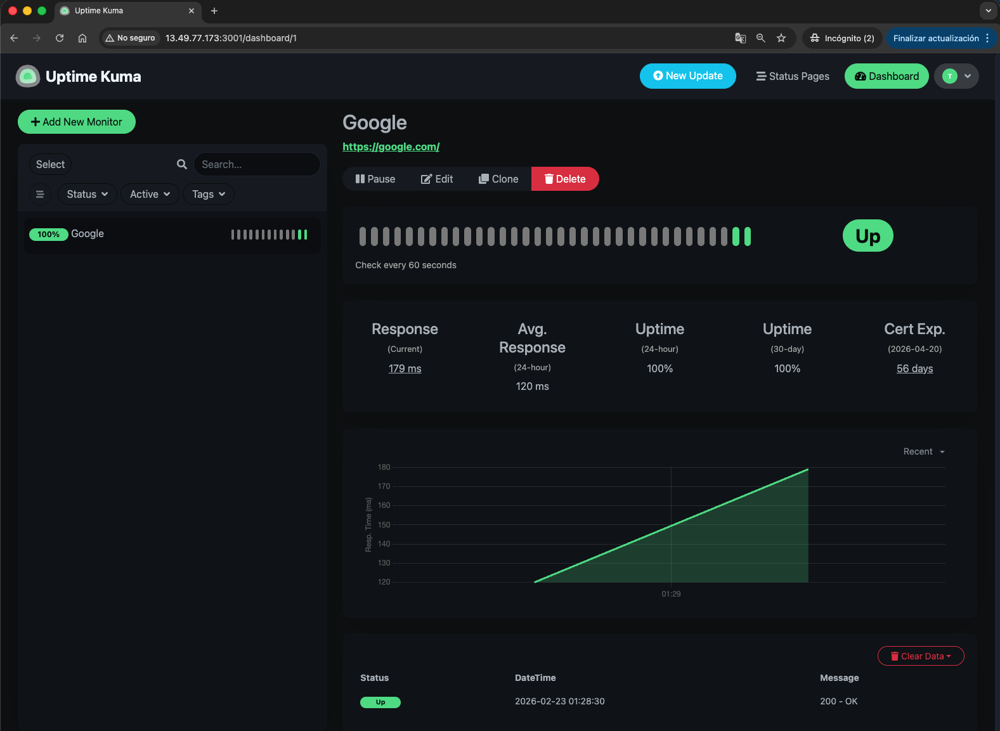

# AWS Cloud Infrastructure for Uptime Kuma

This project deploys a highly available **Uptime Kuma** instance on **AWS Fargate (ECS)** using **Terraform**. It features persistent storage, automated monitoring, and an email notification system.

## 🚀 Project Overview

The goal of this project was to move from a basic container deployment to a production-ready cloud architecture. I implemented a persistent data layer using **Amazon EFS** to ensure that monitoring data is never lost, even if the container restarts.

### Key Features
* **Serverless Computing:** Run on AWS Fargate (No EC2 instances to manage).
* **Persistent Storage:** Amazon EFS integration for database persistence.
* **Security:** Isolated VPC with specific Security Group rules (Port 3001 for Web, 2049 for EFS).
* **Infrastructure as Code:** 100% managed via Terraform.
* **Alerting:** Integrated with Amazon SNS for email notifications.

## 🏗 Architecture Diagram

The infrastructure consists of:
1.  **VPC:** 2 Public Subnets across different Availability Zones.
2.  **ECS Fargate:** Task definition optimized for performance and cost.
3.  **EFS:** Elastic File System mounted to `/app/data` inside the container.
4.  **CloudWatch & SNS:** CPU usage monitoring and email alerts.

## 📸 Dashboard Preview


*(My active monitoring dashboard showing real-time service status)*

---

## 🛠 Deployment Instructions

### Prerequisites
* Terraform installed.
* AWS CLI configured with appropriate credentials.

### Steps
1.  **Initialize Terraform:**
    ```bash
    terraform init
    ```
2.  **Apply Configuration:**
    ```bash
    terraform apply
    ```
3.  **Access the Dashboard:**
    Get the Public IP from the ECS Task console and open `http://<TASK_IP>:3001` in your browser.

## 📝 Lessons Learned
* **EFS Connectivity:** Resolved `ResourceInitializationError` by opening port 2049 in the Security Group to allow communication between the Fargate task and the file system.
* **Network Routing:** Configured Internet Gateways and Route Tables within the VPC module to enable public access to the service.

---
---
*Note: This project is a fork of [louislam/uptime-kuma](https://github.com/louislam/uptime-kuma). I have added the Terraform infrastructure layer to automate its deployment on AWS.*
