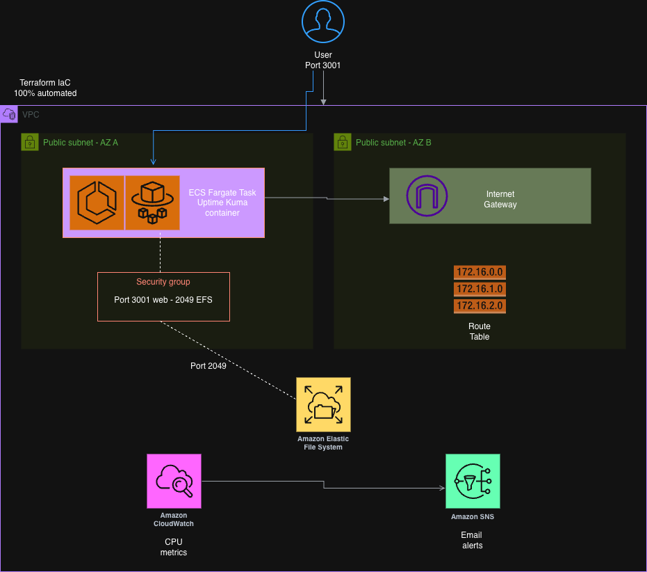

# ☁️ Uptime Kuma — Cloud & Kubernetes Deployment

> Forked from [louislam/uptime-kuma](https://github.com/louislam/uptime-kuma) | Production-ready infrastructure built on top.

This fork focuses entirely on the **infrastructure layer**: deploying Uptime Kuma on AWS using multiple orchestration strategies — from serverless Fargate to a fully managed EKS cluster with Helm.

---

## 🚀 Deployment Strategies

### 1. AWS Fargate + EFS + SNS (Serverless)

Serverless deployment with persistent storage, remote state, and automated alerting.

**Key features:**
- ECS Fargate task (no EC2 to manage)
- EFS mount at `/app/data` for persistent SQLite data
- SNS + CloudWatch for CPU monitoring and email alerts
- VPC with 2 public subnets across Availability Zones
- Terraform remote state in S3 (versioned, AES-256 encrypted, public access blocked)
- GitHub Actions CI/CD: `fmt`, `validate`, `init -backend=false` on every push

## 🏗 Architecture



## 📸 Live Dashboard


*(Active monitoring dashboard showing real-time service status)*

---

### 2. Kubernetes Manifests (Bare)

Full K8s deployment from scratch using `kubectl`.

| Resource | Purpose |
|---|---|
| `Deployment` | Uptime Kuma pod spec |
| `Service` | ClusterIP internal routing |
| `PersistentVolumeClaim` | Persistent data storage |
| `ConfigMap` | Environment configuration |
| `Secret` | Sensitive config (base64) |
| `Ingress` | External HTTP access |

```
k8s/manifests/
```

### 3. Helm Chart (Custom)

Custom-authored Helm chart for parameterized, multi-environment deployments.

- Configurable via `values.yaml`
- Templated Deployment, Service, Ingress, PVC

```bash
helm install uptime-kuma ./k8s/helm -n monitoring
```

### 4. EKS Cluster on AWS (Terraform)

Live EKS cluster provisioned in `eu-central-1` via Terraform. Deployed and validated end-to-end.

```bash
cd k8s/terraform && terraform init && terraform apply
aws eks update-kubeconfig --region eu-central-1 --name uptime-kuma-cluster
helm install uptime-kuma ./k8s/helm -n monitoring
```

---

## 📁 Repo Structure

```
uptime-kuma/
├── .github/workflows/
│   └── terraform-ci.yml      # CI/CD: fmt + validate on every push
├── img/
│   ├── kuma-arc.drawio.png   # Architecture diagram
│   └── kumademo.png          # Dashboard screenshot
├── terraform/
│   ├── bootstrap/            # S3 bucket for remote state (run once)
│   ├── backend.tf
│   └── ...
├── k8s/
│   ├── manifests/            # Raw Kubernetes YAML files
│   ├── helm/                 # Custom Helm chart
│   └── terraform/            # EKS cluster (eu-central-1)
└── [original uptime-kuma source]
```

---

## ⚙️ CI/CD Pipeline

GitHub Actions runs automatically on every push to `main` and on pull requests.

| Step | What it does |
|---|---|
| `terraform fmt -check` | Fails if code is not properly formatted |
| `terraform init -backend=false` | Initializes without connecting to S3 |
| `terraform validate` | Checks for syntax and configuration errors |

---

## 🛠 Quick Deploy

### Fargate (AWS)

```bash
cd terraform/bootstrap && terraform init && terraform apply  # first time only
cd .. && terraform init && terraform apply
# Access: http://:3001
```

### Kubernetes (local)

```bash
minikube start
kubectl create namespace monitoring
helm install uptime-kuma ./k8s/helm -n monitoring
kubectl port-forward service/uptime-kuma 3001:3001 -n monitoring
```

### Kubernetes (EKS)

```bash
cd k8s/terraform && terraform init && terraform apply
aws eks update-kubeconfig --region eu-central-1 --name uptime-kuma-cluster
kubectl create namespace monitoring
helm install uptime-kuma ./k8s/helm -n monitoring
```

---

## 📝 Lessons Learned

- **EFS Connectivity:** Resolved `ResourceInitializationError` by opening port 2049 in the Security Group for EFS communication.
- **Network Routing:** Configured Internet Gateways and Route Tables within the VPC module for public access.
- **Remote State Bootstrap:** S3 backend cannot provision itself — a separate `bootstrap/` module is required before `terraform init`.
- **CI/CD without credentials:** `terraform init -backend=false` allows fmt/validate checks in GitHub Actions without AWS credentials.

---

## 🧠 Tech Stack

`AWS ECS Fargate` · `EKS` · `EFS` · `SNS` · `CloudWatch` · `VPC` · `IAM` · `S3`
`Terraform` · `Kubernetes` · `Helm` · `Docker` · `GitHub Actions`

---

[](https://aws.amazon.com/certification/)
[](https://www.terraform.io/)
[](https://kubernetes.io/)

→ [LinkedIn](https://www.linkedin.com/in/misael-tox/) · [Portfolio](https://github.com/MisaelTox)
